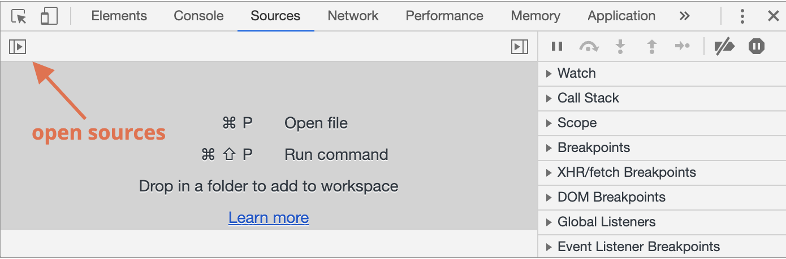
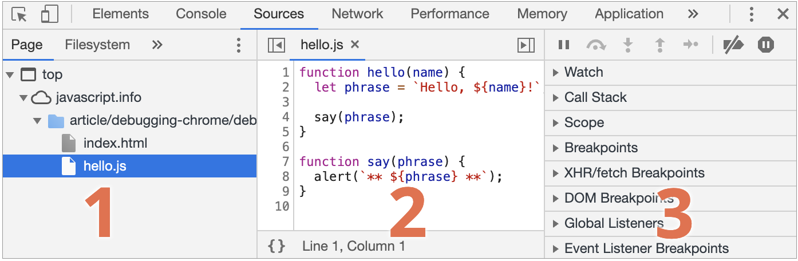

# Chrome 브라우저의 개발자도구 내의 JavaScript 디버깅 방법

- 크롬을 열고 F12를 눌러 개발자 도구를 엽니다.
- Sourse 탭을 클릭합니다.
- 토글 버튼을 누르면 navigator가 열리면서 현재 사이트와 관련된 파일들이 나열됩니다.

- 여기서 디버깅 하고싶은 js파일을 선택해 디버깅을 진행 할 수 있습니다.

- Sources 패널은 세개의 영역으로 구성됩니다.
    1. 파일 탐색 영역: 페이지를 구성하는데 쓰인 모든 리소스를 트리 형태로 보여줍니다.
    2. 코드 에디터 영역: 리소스 영역에서 선택한 파일의 소스 코드를 보여줍니다. 여기서 소스코드를 편집 할 수 있다.
    3. 자바스크립트 디버깅 영역: 디버깅에 관련된 기능을 제공합니다.
    

