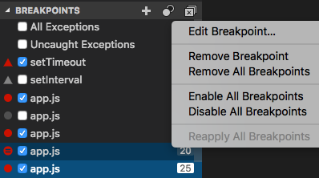

# breakpoint란

## 중단 점

에디터의 여백을 클릭 하거나 현재 행에서 F9 를 사용하여 중단 점을 전환 할 수 있습니다 . Run view의 **BREAKPOINTS** 섹션 에서 더 나은  제어 (활성화 / 비활성화 / 다시 적용)를 수행 할 수 있습니다 .

- 편집기 여백의 breakpoint 은 일반적으로 빨간색으로 채워진 원으로 표시됩니다.
- 비활성화 된 breakpoint 은 회색 원으로 채워져 있습니다.
- 디버깅 세션이 시작되면 디버거에 등록 할 수없는 breakpoint 이 회색 빈 원으로 바뀝니다. 라이브 편집을 지원하지 않는 디버그 세션이 실행되는 동안 소스를 편집하는 경우에도 마찬가지입니다.

**다시 적용 모든 breakpoint의** 명령은 원래 위치에 다시 모든 breakpoint을 설정합니다. 디버그 환경이 아직 실행되지 않은 소스 코드에서 "lazy"및 "misplaces" breakpoint 인 경우에 유용합니다.

선택적으로 breakpoint 은 설정을 활성화하여 편집기의 개요 눈금자에 표시 할 수 있습니다 `debug.showBreakpointsInOverviewRuler`.

​    

​    

# step over, step into, step out

## step over

- 한 라인을 실행하지만 함수를 호출할 경우 메소드 내부로 들어가지 않고 현재 스코프의 다음 행으로 진행한다.

## step into

- 한 라인을 실행하지만 함수 호출이 존재할 경우 함수 내부로 들어간다.
- 만약 함수가 아닐 경우 step over와 동일하게 진행된다.

## step out 

- 함수를 끝까지 실행시키고 호출시킨 곳으로 되돌아 간다. 즉 제어가 이전 스택 프레임으로 돌아갈 때까지 진행된다. 