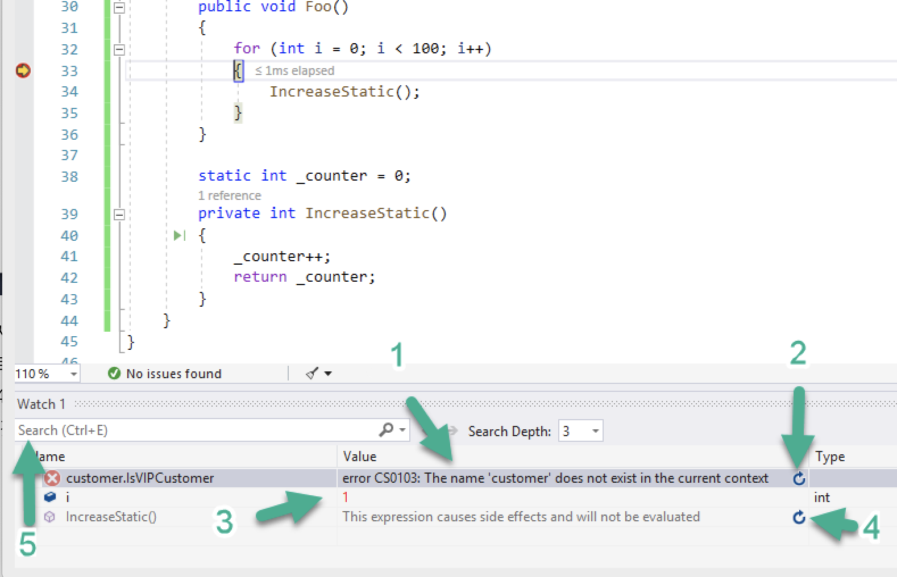

# watch 사용 방법
- 디버깅 하는 동안 watch window를 이용하여 변수와 식을 볼 수 있다.
- watch window는 디버깅 중에만 사용 가능하다.
- watch window는 디버깅 하는 동안 한번에 여러 변수를 표시 할 수 있다.
- 디버깅을 진행하면서 breakpoint로 디버깅이 멈춘 라인의 상태에서 내가 원하는 변수의 값이나 상태등을 확인 할 수 있다. 
- 현재 상태에서 컴파일이 불가능하면 그림의 1번처럼 컴파일 에러를 출력한다.
